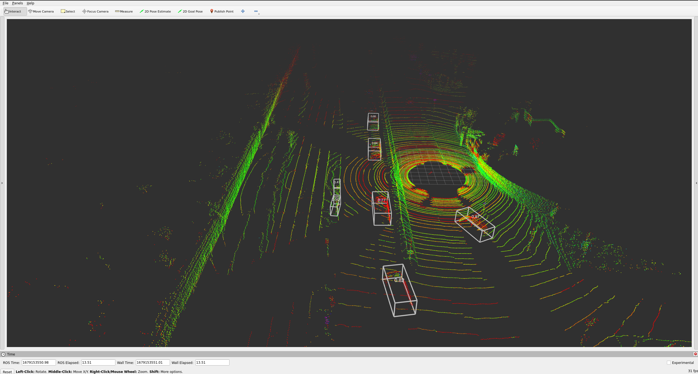

# pcdet_ros2

This is a ROS 2 Wrapper for [`[OpenPCDet]`](https://github.com/open-mmlab/OpenPCDet).



**Test System**
- Computation: i9-12900K, GPU 4080
- System Setup: 
    - Ubuntu 22.04, ROS 2 Humble
    - CUDA 11.7, CuDNN 8.5.0.96
    - Python 3.10, PyTorch 2.0
- OpenPCDet Version: `v0.6.0`

**Status**
- Successfully Tested with [Kitti 3D Object Detection](https://www.cvlibs.net/datasets/kitti/eval_object.php?obj_benchmark=3d) and [nuScenes](https://www.nuscenes.org/nuscenes) based models.
- The package can be used for deployment of the models. For deployment it is not necessary to download the dataset, it will directly work with the input pointcloud.

# Content
- [OpenPCDet Installation](#openpcdet-installation)
- [Installation](#installation)
- [Usage](#usage)
- [Parameters](#parameters)
- [License](#license)
- [Citation](#citation)

# OpenPCDet Installation
Quick Installation compatible with the setup specified above:
```console
git clone https://github.com/open-mmlab/OpenPCDet
python3 -m pip install torch torchvision torchaudio
python3 -m pip install tensorflow
python3 -m pip install spconv-cu117
cd OpenPCDet
python3 -m pip install -r requirements.txt
python3 setup.py develop
python3 -m pip install kornia open3d
python3 -m pip install pyquaternion
```

Please refer to [OpenPCDet's INSTALL.md](https://github.com/open-mmlab/OpenPCDet/blob/master/docs/INSTALL.md) for the original installations instructions of `OpenPCDet`. Try the [Quick Demo](https://github.com/open-mmlab/OpenPCDet/blob/master/docs/DEMO.md) to verify installations.

- [ ] This project provides a docker installation reference [DOCKER_INSTALL.md](docs/DOCKER_INSTALL.md) which is highly recommended.

# Installation
**<u>Build the Packages</u>**
```console
# GOTO the ros 2 workspace
cd src/
git clone https://github.com/Box-Robotics/ros2_numpy -b humble
python3 -m pip install catkin_pkg
sudo apt install ros-humble-ament-cmake-nose -y
python3 -m pip install nose
python3 -m pip install transform3d
git clone https://github.com/pradhanshrijal/pcdet_ros2
cd ..
rosdep install -i --from-path src --rosdistro humble -y
colcon build --symlink-install --packages-select ros2_numpy pcdet_ros2
# Source the workspace
```

**<u>Download the weights</u>**
<br>Example:
- Download the PV-RCNN pre-trained weight for the Kitti Dataset [`[model-50M]`](https://drive.google.com/file/d/1lIOq4Hxr0W3qsX83ilQv0nk1Cls6KAr-/view?usp=sharing).
- Copy the weight to the checkpoints folder of the pcdet_ros2 package.

Check [OpenPCDet's Model Zoo](https://github.com/open-mmlab/OpenPCDet#model-zoo) for available models and weights.

P.S. Symlink connections will save a lot of storage space and help organise the files.

# Usage
```console
ros2 launch pcdet_ros2 pcdet.launch.py
```

# Parameters

| Parameter | Description |
|:-----------:|:------------|
| config_file | Local Path to the configuration file for the model. |
| model_file | Local Path to the pre-trained weight for the model. |
| allow_memory_fractioning | Boolean to activate setting a limit to the GPU Usage. <br>&emsp; Used together with `device_memory_fraction`. |
| allow_score_thresholding | Boolean to activate the removal of low scored detections. <br>&emsp; Used together with `threshold_array`. |
| num_features | Parameter to specify data transformation of pointcloud. <br>&emsp; For `Kitti` the value is `4`. <br>&emsp; For `nuScenes` the value is `5`. |
| device_id | ID for the GPU to be used. |
| device_memory_fraction | GPU Memory (in GB) used for the detections. <br>&emsp; Used together with `allow_memory_fractioning`. |
| threshold_array | Threshold values for low scoring detections. <br>&emsp; Used together with `allow_score_thresholding`. <br>&emsp; See the `config_file` for the list of detections. |

# License

`pcdet_ros2` is released under the [MIT](LICENSE) License.

# Citation 
If you find this project useful in your research, please consider citing the original work:


```
@misc{openpcdet2020,
    title={OpenPCDet: An Open-source Toolbox for 3D Object Detection from Point Clouds},
    author={OpenPCDet Development Team},
    howpublished = {\url{https://github.com/open-mmlab/OpenPCDet}},
    year={2020}
}
```